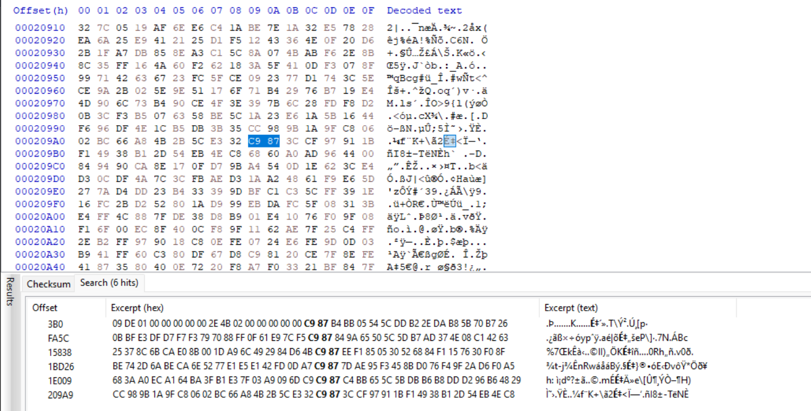
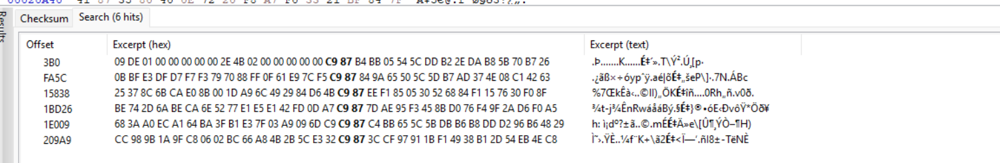

### PoC
(just skip the ad1 chunk fixing part, its not really needed)

Refferences:
1. https://stackoverflow.com/questions/9050260/what-does-a-zlib-header-look-like
2. https://web.archive.org/web/20210619230227/https://tmairi.github.io/posts/dissecting-the-ad1-file-format/#ad1-data-structures
3. https://www.rfc-editor.org/rfc/rfc1950

ad1 is using zlib compressed files, with header 78 9C

so just need to dump the zlib data, which we could see have the same header (c9 87), this was clarified by the first zlib appears just after the file name



and we could take that to fix it into its real value (78 9c)



there are not so many broken zlib, so just dump it all and fix it

but because we dont know which one is the valid zlib or the "just raw data". we can apply method when chunk N fails to inflate, we need to combine chunk N + chunk N+1 + chunk N+2 + ..., until the inflate finally succeeds. (but skip if: the inflate failed -> dont "fix" the failed blob)

```python
#!/usr/bin/env python3
import zlib
from pathlib import Path

INPUT_FILE = Path("minami.ad1")
HEADER_OLD = b"\xC9\x87"
HEADER_NEW = b"\x78\x9C"
OUT_PREFIX = "chunk_"


def find_all(data: bytes, pattern: bytes):
    positions = []
    start = 0
    plen = len(pattern)
    while True:
        idx = data.find(pattern, start)
        if idx == -1:
            break
        positions.append(idx)
        start = idx + plen
    return positions


def main():
    data = INPUT_FILE.read_bytes()
    offsets = find_all(data, HEADER_OLD)

    print(f"[+] Found {len(offsets)} headers at C9 87")

    total_chunks = len(offsets)
    successful_chunks = [] 

    for i in range(total_chunks):
        start = offsets[i]
        end = offsets[i + 1] if i + 1 < total_chunks else len(data)

        base_chunk = data[start:end]

        # replace only the first header
        merged = HEADER_NEW + base_chunk[len(HEADER_OLD):]
        merge_count = 0

        while True:
            try:
                decompressed = zlib.decompress(merged)

                # save individual decompressed chunk (optional but useful)
                out_name = f"{OUT_PREFIX}{i:03d}.decompressed"
                Path(out_name).write_bytes(decompressed)
                print(f"[+] Chunk {i} OK after merging {merge_count} extra chunks -> {out_name}")

                successful_chunks.append(decompressed)
                break

            except Exception as e:
                # no more chunks to merge -> give up on this starting chunk
                if i + 1 + merge_count >= total_chunks:
                    print(f"[!] Chunk {i} FAILED even after merging all possible chunks ({e})")
                    break

                # append next chunk RAW (no header fix)
                next_start = offsets[i + 1 + merge_count]
                next_end = offsets[i + 2 + merge_count] if (i + 2 + merge_count) < total_chunks else len(data)

                extra_raw = data[next_start:next_end]
                merged += extra_raw
                merge_count += 1

                print(f"[>] Chunk {i} failed ({e}), merging chunk {i + merge_count}...")

    # After processing all chunks, merge all successful decompressed data into one PDF
    if successful_chunks:
        combined = b"".join(successful_chunks)
        Path("flag.pdf").write_bytes(combined)
        print(f"[+] Merged {len(successful_chunks)} decompressed chunks into flag.pdf")


if __name__ == "__main__":
    main()
```